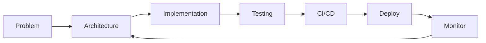

<!-- ═══════════════════════════════════════════════════════════════ -->

<!--                           HEADER                               -->

<!-- ═══════════════════════════════════════════════════════════════ -->

<div align="center">

# AAYUSH NAMDEO

### Software Engineer · Full-Stack · Cloud · AI

<p>
Building systems, products, and infrastructure that solve real problems.
</p>

<p>
<a href="https://github.com/ayeus">

</a>
<a href="https://www.linkedin.com/in/aayush-namdeo-299660287/">

</a>
</p>

</div>

---

## `> whoami`

```text
Aayush Namdeo
────────────────────────────────────────────

Role        Software Engineer
Focus       Backend · Cloud · AI · Full-Stack
Languages   C++ · Java · Python · Go · Rust · TypeScript
Building    SN
Interests   Distributed Systems · AI Infrastructure
            Cloud Architecture · System Design

Location    India
```

---

## ⚡ What I'm Building

<div align="center">

### `SN`

**AI Infrastructure Platform**

Building an infrastructure-focused platform around AI workloads,
cloud systems, developer tooling, and scalable backend architecture.

`Next.js` · `TypeScript` · `Go` · `Rust` · `AWS` · `Docker`

<br>

<a href="https://github.com/ayeus">

</a>

</div>

---

## 🚀 Featured Projects

<table>
<tr>
<td width="50%">

### 🛰️ SentinelGIS

**Data Analytics & Risk Prediction System**

Geospatial analytics platform combining data processing,
machine learning, and GIS for risk analysis and prediction.

**Stack**

`Python` `SQL` `ML` `GIS` `TensorFlow`

<br>

<a href="https://github.com/ayeus/Sentinel-GIS">

</a>

</td>

<td width="50%">

### ⚙️ SN

**AI Infrastructure Platform**

Exploring scalable infrastructure for AI workloads,
cloud systems, developer tooling, and high-performance services.

**Stack**

`Go` `Rust` `AWS` `Docker` `TypeScript`

<br>

<a href="https://github.com/ayeus">

</a>

</td>
</tr>

<tr>
<td width="50%">

### 🔌 Backend Systems

**APIs & Distributed Services**

Building backend services with clean architecture,
database integration, authentication, and production-ready APIs.

**Stack**

`Java` `Spring Boot` `Python` `Go` `SQL`

</td>

<td width="50%">

### 🧠 AI / ML Systems

**Applied Machine Learning**

Building practical ML systems involving prediction,
recommendation, data processing, and intelligent automation.

**Stack**

`Python` `TensorFlow` `Keras` `Scikit-learn`

</td>
</tr>
</table>

---

## 🧰 Tech Stack

<details>
<summary><b>Languages</b></summary>

<br>

<p>

</p>

</details>

<details>
<summary><b>Frontend</b></summary>

<br>

<p>

</p>

</details>

<details>
<summary><b>Backend</b></summary>

<br>

<p>

</p>

</details>

<details>
<summary><b>Cloud & Infrastructure</b></summary>

<br>

<p>

</p>

</details>

<details>
<summary><b>Databases</b></summary>

<br>

<p>

</p>

</details>

<details>
<summary><b>AI / Data</b></summary>

<br>

<p>

</p>

`Pandas` · `NumPy` · `Scikit-learn` · `Keras` · `GIS` · `Data Processing`

</details>

---

## 🧠 Engineering Interests

```text
┌─────────────────────────────────────────────────────┐
│                                                     │
│   BACKEND            CLOUD             AI           │
│   APIs               AWS               ML           │
│   Databases          Docker            AI Infra     │
│   Architecture       CI/CD             LLM Systems  │
│                                                     │
│   SYSTEMS            DATA              FRONTEND     │
│   Distributed        Pipelines         React        │
│   Performance        Analytics         Next.js      │
│   System Design      Processing        TypeScript   │
│                                                     │
└─────────────────────────────────────────────────────┘
```

---

## 📊 GitHub

<div align="center">

<a href="https://github.com/ayeus">


</a>

<a href="https://github.com/ayeus">


</a>

</div>

---

## 📈 Contribution Activity

<div align="center">


</div>

---

## 🐍 Contribution Snake

<div align="center">


</div>

---

## 🎯 Currently Exploring

<table>
<tr>
<td>

### Distributed Systems

Designing reliable and scalable services.

</td>
<td>

### AI Infrastructure

Building systems around AI workloads.

</td>
<td>

### Cloud Architecture

Learning how production systems scale.

</td>
</tr>
</table>

---

## 🛠️ How I Build



---

## 📌 Engineering Principles

> **Build simple systems first.
> Measure before optimizing.
> Automate repetitive work.
> Design for failure.
> Keep learning.**

---

## 🔭 Roadmap

<details>
<summary><b>2026 → What I'm working toward</b></summary>

<br>

* [x] Full-stack development
* [x] Backend development
* [x] Machine Learning projects
* [x] Cloud fundamentals
* [x] Data & analytics projects
* [ ] Advanced system design
* [ ] Distributed systems
* [ ] Production-grade AI infrastructure
* [ ] Open-source contributions
* [ ] Large-scale backend systems

</details>

---

## 💬 Let's Connect

<div align="center">

If you're interested in **software engineering, AI infrastructure,
cloud systems, backend engineering, or building ambitious products** —

**let's connect.**

<br>

<a href="https://github.com/ayeus">

</a>

<a href="https://www.linkedin.com/in/aayush-namdeo-299660287/">

</a>

</div>

---

<div align="center">

### `BUILD → BREAK → LEARN → REBUILD`

<br>


</div>
