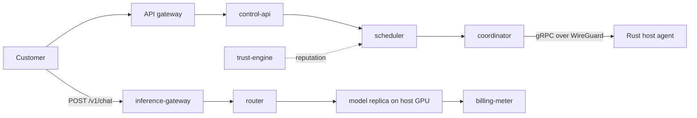
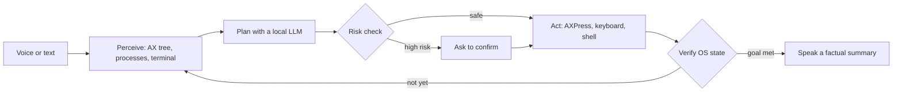
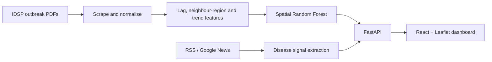

<!-- Images are generated from profile/profile.toml by profile/build.py -->

<a href="https://github.com/ayeus">
  <picture>
    <source media="(prefers-color-scheme: dark)" srcset="https://raw.githubusercontent.com/ayeus/ayeus/main/assets/hero-dark.svg">
    
  </picture>
</a>

<p align="center">
  <a href="https://www.linkedin.com/in/aayush-namdeo-299660287/"></a>
  <a href="#-what-im-building"></a>
  <a href="https://github.com/ayeus?tab=repositories"></a>
  
</p>

## ⚡ What I'm building

<a href="https://github.com/ayeus/SN">
  <picture>
    <source media="(prefers-color-scheme: dark)" srcset="https://raw.githubusercontent.com/ayeus/ayeus/main/assets/card-ayeusann-dark.svg">
    
  </picture>
</a>

<p>
<a href="https://github.com/ayeus/MAX"><picture><source media="(prefers-color-scheme: dark)" srcset="https://raw.githubusercontent.com/ayeus/ayeus/main/assets/card-max-dark.svg"></picture></a>
<a href="https://github.com/ayeus/Sentinal-GIS"><picture><source media="(prefers-color-scheme: dark)" srcset="https://raw.githubusercontent.com/ayeus/ayeus/main/assets/card-sentinel-dark.svg"></picture></a>
</p>

<sub>Click a card to open the repo. Click a heading below to see how it works.</sub>

<details>
<summary><b>🛰️ AyeusANN: how a request reaches an idle GPU</b></summary>
<br>

Hosts run a Rust agent that detects and benchmarks their GPUs and joins an outbound-only WireGuard mesh. Eight Go services handle auth, scheduling, routing, billing and host reputation.



`Go` · `Rust` · `gRPC / protobuf` · `PostgreSQL` · `Redis` · `NATS` · `MinIO` · `Docker Compose`
</details>

<details>
<summary><b>🎙️ MAX: why it doesn't trust its own clicks</b></summary>
<br>

Most assistants report success once they've *sent* an action. MAX runs a closed loop: it re-reads the OS state after every step and only reports success when the result is really there.



Runs 100% offline on Apple Silicon (Ollama + local Whisper). Tamper-evident audit log, process-group isolation, 228 tests.
</details>

<details>
<summary><b>🛡️ SentinelGIS: from government PDFs to a risk map</b></summary>
<br>



Weekly refresh and retraining, district-level forecasts 1–3 months ahead, and news-verified alerts on a live map.
</details>

## 🧰 Stack

<p>
  
  &nbsp;
  
</p>
<p>
  
  &nbsp;
  
  &nbsp;
  
</p>

<details>
<summary><b>Full list</b></summary>

```toml
[languages]  python, go, rust, typescript, javascript, c++, java, sql
[backend]    fastapi, spring boot, node.js, rest, microservices, websockets
[data]       postgresql, mysql, mongodb, dynamodb, redis, kafka, nats
[ai]         pytorch, tensorflow, scikit-learn, langchain, langgraph, rag, mcp, ollama
[infra]      aws, gcp, azure, docker, kubernetes, terraform, ansible, github actions
[network]    wireguard, firecracker microvms, tcp/ip, linux
```
</details>

## 🗂️ More from the lab

| Repo | What it is |
|---|---|
| [EduForge](https://github.com/ayeus/EduForge) | Personalised LMS with a chatbot and messaging · Flask · AWS S3 |
| [SocialSense](https://github.com/ayeus/SocialSense) | Reddit + X sentiment analysis · transformers · Streamlit |
| [AI-dictionary](https://github.com/ayeus/AI-dictionary) | LLM-powered dictionary with quizzes · Groq |
| [Automated-Financial-Data-Pipeline](https://github.com/ayeus/Automated-Financial-Data-Pipeline) | Inventory & sales data pipeline · Flask · Excel |
| [Image-Comprssor](https://github.com/ayeus/Image-Comprssor) | Image & PDF compression service · Flask |

<br>

<p align="center">
  <b><code>BUILD → BREAK → LEARN → REBUILD</code></b>
</p>
